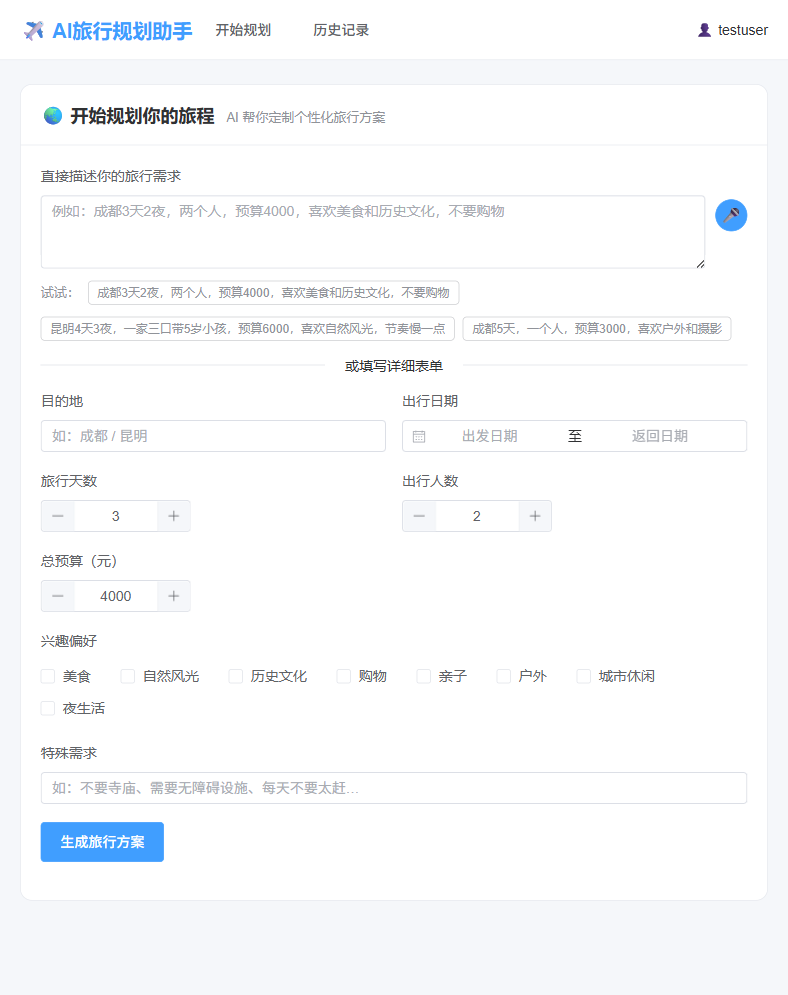
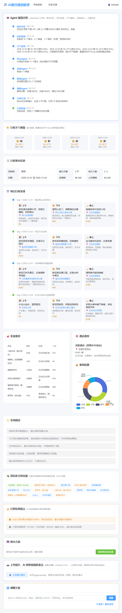
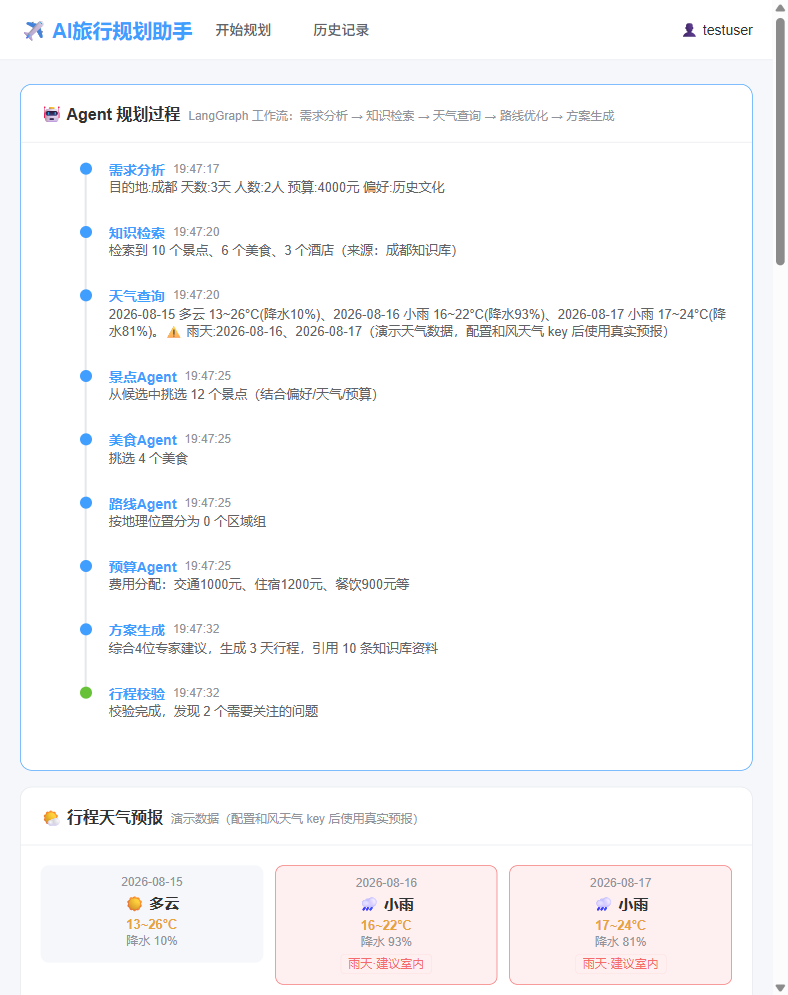
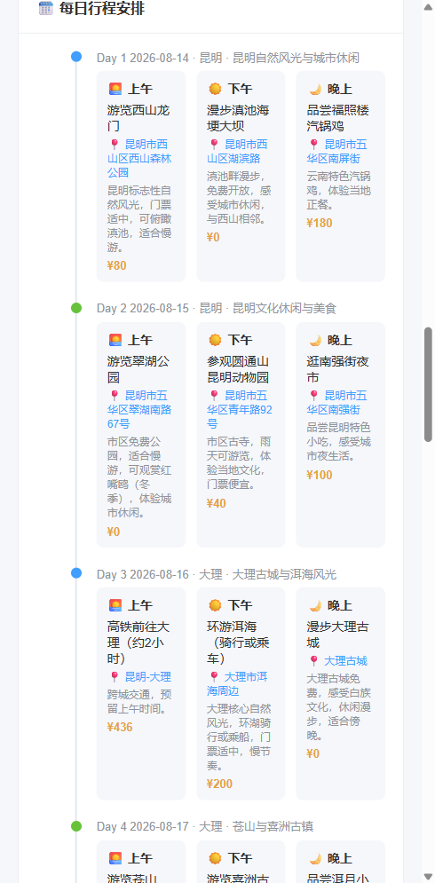
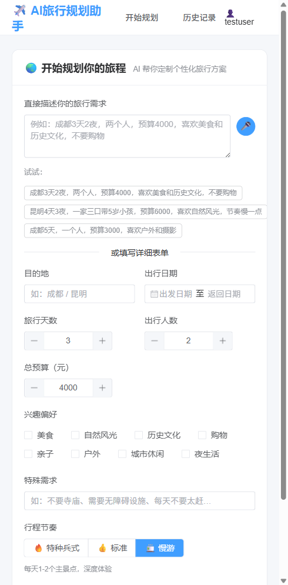
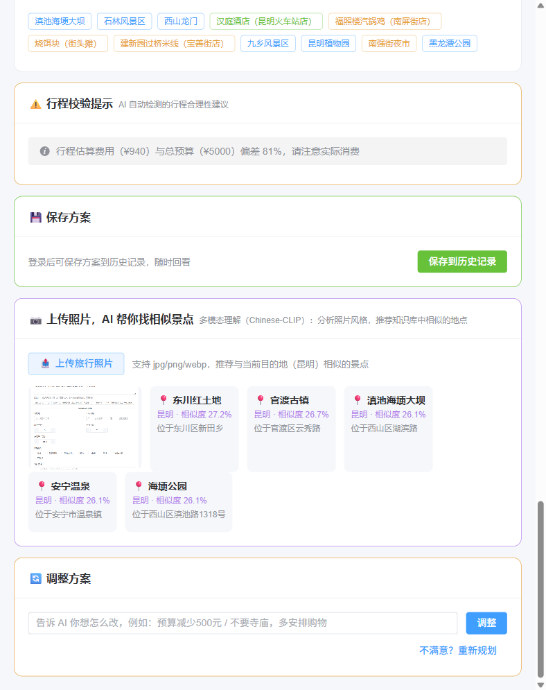
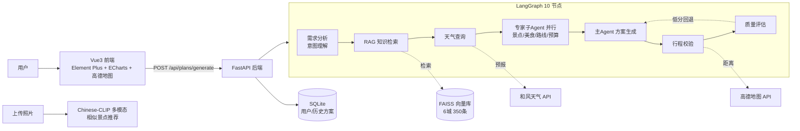

# ✈️ AI旅行规划助手

> 基于 **LLM Agent 架构** 的智能旅行规划系统：多 Agent 协作 + RAG 知识增强 + 外部工具调用 + 多模态理解 + 质量闭环，实现多约束条件下的个性化旅行方案自动生成。

   

---

## ✨ 核心特性

| 特性 | 说明 |
|---|---|
| 🤖 **多 Agent 协作** | LangGraph 10 节点工作流：需求分析 → RAG检索 → 天气查询 → 4位专家子Agent（景点/美食/路线/预算）**并行**协作 → 主Agent汇总 → 行程校验 → 质量评估 |
| 📚 **RAG 知识增强** | 6 城手工知识库（165 景点/103 美食/77 酒店），BGE 向量 + FAISS + Rerank 精排，方案推荐**强制引用知识库 source_id**，可追溯不胡编 |
| 🧭 **多地联游** | 支持跨城行程：多目的地自动解析（含「川渝」「云南」等组合叫法）、按城市分段排程、**跨城日自动生成高铁衔接节点** |
| 📊 **质量闭环** | 规则+LLM 双引擎 5 维评分（预算/路线/引用/结构/贴合度），**总分 <70 自动携带改进建议重新生成** |
| 🧠 **意图理解** | 需求解析阶段推断隐含意图（核心诉求/关键约束/隐含需求），注入生成过程——"带5岁小孩"自动体现亲子安全与慢节奏 |
| 🛠️ **外部工具** | 和风天气真实预报（雨天自动调室内）、高德驾车距离（真实路线校验）、Chinese-CLIP 多模态（上传照片找相似景点）、语音输入 |
| ⚖️ **对比方案** | 并行生成「性价比版 / 舒适版」两套方案，一键切换 + 对比表格 |
| 🗺️ **行程地图** | 每日行程高德真实地图路线展示（未配置 key 自动降级 SVG 示意） |
| 📤 **导出分享** | 一键导出 PDF / 高清长图行程单 |

## 📸 界面预览

| 首页（需求输入） | 完整方案展示 |
|---|---|
|  |  |

| Agent 规划过程 | 多地联游（跨城行程） |
|---|---|
|  |  |

| 行程节奏选项 | 多模态（照片找相似景点） |
|---|---|
|  |  |

## 🏗️ 系统架构



## 🛠️ 技术栈

| 层 | 技术 |
|---|---|
| 后端 | Python 3.13 + FastAPI + LangGraph + SQLite |
| 前端 | Vue3 + Vite + Element Plus + ECharts + 高德 JS API |
| LLM | DeepSeek API（JSON 模式 + 思考模式控制） |
| RAG | BGE-small-zh + FAISS + bge-reranker（本地 GPU 推理） |
| 多模态 | Chinese-CLIP（本地部署） |
| 外部工具 | 和风天气 / 高德地图（均可配置降级，无 key 也能演示） |
| 认证 | JWT + PBKDF2 密码哈希 |

## 🚀 快速开始

### 1. 克隆并安装依赖

```bash
git clone https://github.com/<your-username>/ai-travel-planner.git
cd ai-travel-planner
```

### 2. 后端

```bash
cd backend
pip install -r requirements.txt

# 配置 API key（必配 DeepSeek，可选和风天气/高德）
copy .env.example .env   # 然后编辑 .env 填入密钥

# 下载本地模型（BGE 向量/重排 + Chinese-CLIP，约 1.5GB，从 ModelScope 国内直连）
python download_models.py

# 构建知识库向量索引（6 城 350 条文档）
python build_index.py

# 启动服务（端口 8003）
uvicorn app.main:app --port 8003
```

### 3. 前端

```bash
cd frontend
npm install
npm run dev        # http://localhost:5173

# 可选：高德 JS API key（真实地图），复制 .env.example 为 .env 填写
```

### 4. 打开浏览器

访问 **http://localhost:5173**，输入：

> "成都重庆5天4夜，两个人，预算6000，喜欢美食和夜景"

或试试组合叫法：**"川渝4天"**、**"昆明大理丽江6天"**。

## 🗂️ 知识库（6 城 350 条）

| 城市 | 景点 | 美食 | 酒店 | 线路 |
|---|---|---|---|---|
| 成都 | 30 | 20 | 15 | 川渝线 |
| 重庆 | 28 | 18 | 12 | 川渝线 |
| 昆明 | 30 | 20 | 15 | 云南线 |
| 大理 | 23 | 15 | 10 | 云南线 |
| 丽江 | 24 | 15 | 10 | 云南线 |
| 西安 | 30 | 20 | 15 | 单城深度 |

**数据可信度流程**：LLM 辅助生产 → 规则校验（ID/字段/数值范围）→ **高德 POI 交叉校验**（景点坐标与高德官方坐标对比，偏差自动校正，>50km 标记人工）→ 人工抽检。每条数据带 `source`（来源）与 `verified_at`（校验日期），前端引用可 hover 查看。

```bash
# 新增城市：注册 CITIES + 生成数据 + 校验 + 重建索引
python gen_city_kb.py <city>        # LLM 辅助生成（覆盖矩阵约束）
python verify_knowledge.py          # 高德 POI 坐标交叉校验
python build_index.py               # 重建向量索引
```

## 🧪 测试

```bash
cd backend
python test_rag.py          # RAG 检索质量抽查
python test_agent.py        # Agent 工作流（雨天调整/路线聚类）
python test_quality.py      # 质量评估 + 意图理解
python test_multicity.py    # 多地联游（川渝/云南线）
python test_auth.py         # 用户系统（注册/登录/历史/隔离）
python test_plan_quick.py   # 端到端方案生成
python test_vision.py       # 多模态图片推荐
python test_variants.py     # 对比方案生成
```

## 📁 目录结构

```
ai-travel-planner/
├── backend/
│   ├── app/
│   │   ├── main.py              # FastAPI 入口
│   │   ├── api/                 # 路由：plans/rag/agent/auth/history/vision
│   │   └── services/            # LLM/RAG/Agent/质量评估/意图/天气/地图/多模态
│   ├── knowledge/               # 6 城知识库（JSON，含来源与校验信息）
│   ├── models/                  # 本地模型（.gitignore 排除，download_models.py 下载）
│   ├── data/                    # 向量索引/SQLite（.gitignore 排除）
│   ├── gen_city_kb.py           # 新城市知识库生成
│   ├── verify_knowledge.py      # 高德 POI 可信度校验
│   ├── build_index.py           # 向量索引构建
│   └── test_*.py                # 8 个验收测试
├── frontend/                    # Vue3 + Vite + Element Plus
│   └── src/
│       ├── views/               # HomeView/ResultView/HistoryView
│       └── components/          # ItineraryMap（地图）/ AuthDialog
├── DEMO_SCRIPT.md               # 5 分钟演示脚本
├── PITCH_POINTS.md              # 答辩要点（五大亮点 + Q&A）
└── README.md
```

## 📝 许可

本项目仅用于学习与作品展示。知识库数据为公开信息整理，价格等信息可能随季节变化，请以景区官方为准。
